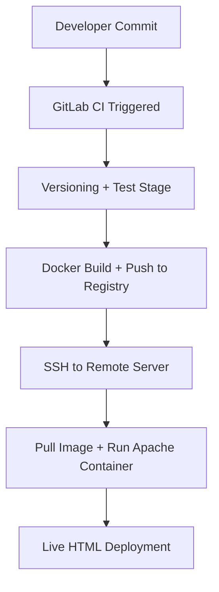

# ✨ GitLab CI/CD Pipeline: Apache HTML Deployment with Docker & CD

## ✨ Project Goal

Below is a high-level architecture diagram that represents the CI/CD pipeline workflow:



Automate the CI/CD lifecycle for a static HTML file (`index.html`) using:

* GitLab CE (Docker-based)
* GitLab Runner (Docker-based)
* Apache HTTP Server (Docker image)
* Versioning and testing
* Docker Image build & push to GitLab Container Registry
* Auto-deployment to a remote server via SSH Automate the CI/CD lifecycle for a static HTML file (`index.html`) using:
* GitLab CE (Docker-based)
* GitLab Runner (Docker-based)
* Apache HTTP Server (Docker image)
* Versioning and testing
* Docker Image build & push to GitLab Container Registry
* Auto-deployment to a remote server via SSH

---

## ✅ Step 1: Install GitLab CE & Runner with Docker

### GitLab CE

This setup assumes that GitLab CE is being deployed locally using Docker. For remote or production use cases, be sure to configure the `hostname` and `external_url` accordingly to match the public domain or IP of the server, allowing external users or runners to reach the GitLab instance properly.

```bash
mkdir -p ~/gitlab-docker/{config,logs,data}
cd ~/gitlab-docker
```

**docker-compose.yml**

```yaml
version: '3'
services:
  gitlab:
    image: gitlab/gitlab-ce:latest
    container_name: gitlab
    restart: always
    hostname: 'gitlab.local'
    environment:
      GITLAB_OMNIBUS_CONFIG: |
        external_url 'http://localhost:8929'
    ports:
      - '8929:8929'
      - '2222:22'
    volumes:
      - './config:/etc/gitlab'
      - './logs:/var/log/gitlab'
      - './data:/var/opt/gitlab'
```

Run:

```bash
docker-compose up -d
```

### GitLab Runner

```bash
mkdir -p ~/gitlab-runner-docker/config

docker run -d --name gitlab-runner \
  --restart always \
  -v /var/run/docker.sock:/var/run/docker.sock \
  -v ~/gitlab-runner-docker/config:/etc/gitlab-runner \
  gitlab/gitlab-runner:latest
```

Register runner:

```bash
docker exec -it gitlab-runner gitlab-runner register
```

Use `docker` executor and set image: `alpine:latest` or `httpd:2.4`

---

## 📁 Step 2: Project Structure

```bash
html-pipeline/
├── index.html
├── version.txt
├── Dockerfile
└── .gitlab-ci.yml
```

### index.html

```html
<!DOCTYPE html>
<html>
<head><title>CI/CD Page</title></head>
<body><h1>Hello from GitLab CI/CD!</h1></body>
</html>
```

### Dockerfile

This Dockerfile builds the final deployment image using Apache (`httpd:2.4`) to serve the static HTML content. It's optimized for running a live container that will serve traffic in production.

```Dockerfile
FROM httpd:2.4
COPY index.html /usr/local/apache2/htdocs/
COPY version.txt /usr/local/apache2/htdocs/
```

> Note: While `httpd` is used here for deployment, the `test` stage in `.gitlab-ci.yml` uses `alpine` for simplicity and speed during validation. This distinction allows the pipeline to stay fast while keeping the production image reliable for serving.

```Dockerfile
FROM httpd:2.4
COPY index.html /usr/local/apache2/htdocs/
COPY version.txt /usr/local/apache2/htdocs/
```

---

## ⚙️ Step 3: GitLab CI/CD Configuration

### .gitlab-ci.yml

```yaml
stages:
  - versioning
  - test
  - build-and-push
  - deploy

variables:
  IMAGE_NAME: registry.gitlab.com/$CI_PROJECT_PATH/html-page
  IMAGE_TAG: $CI_COMMIT_SHORT_SHA

before_script:
  - echo "Pipeline initialized..."

versioning:
  stage: versioning
  script:
    - VERSION=$(date +%Y%m%d%H%M%S)
    - echo $VERSION > version.txt
    - git config --global user.email "ci@example.com"
    - git config --global user.name "CI Bot"
    - git add version.txt || true
    - git commit -m "version updated to $VERSION" || true
    - git push origin $CI_COMMIT_BRANCH || true
  only:
    - main

test:
  stage: test
  image: alpine
  script:
    - test -f index.html
    - grep "<html>" index.html || (echo "Missing <html> tag" && exit 1)

build-and-push:
  stage: build-and-push
  image: docker:latest
  services:
    - docker:dind
  script:
    - export VERSION=$(cat version.txt)
    - echo "$CI_REGISTRY_PASSWORD" | docker login -u "$CI_REGISTRY_USER" --password-stdin $CI_REGISTRY
    - docker build -t $IMAGE_NAME:$IMAGE_TAG -t $IMAGE_NAME:version-$VERSION -t $IMAGE_NAME:latest .
    - docker push $IMAGE_NAME:$IMAGE_TAG
    - docker push $IMAGE_NAME:version-$VERSION
    - docker push $IMAGE_NAME:latest
  only:
    - main

deploy:
  stage: deploy
  image: alpine:latest
  before_script:
    - apk add --no-cache openssh
    - mkdir -p ~/.ssh
    - echo "$DEPLOY_SSH_KEY" > ~/.ssh/id_rsa
    - chmod 600 ~/.ssh/id_rsa
    - ssh-keyscan -H $DEPLOY_SERVER >> ~/.ssh/known_hosts
  script:
    - export VERSION=$(cat version.txt)
    - export FULL_TAG=registry.gitlab.com/$CI_PROJECT_PATH/html-page:version-$VERSION
    - ssh $DEPLOY_USER@$DEPLOY_SERVER "docker login -u $CI_REGISTRY_USER -p $CI_REGISTRY_PASSWORD $CI_REGISTRY"
    - ssh $DEPLOY_USER@$DEPLOY_SERVER "docker pull $FULL_TAG"
    - ssh $DEPLOY_USER@$DEPLOY_SERVER "docker stop html-container || true && docker rm html-container || true"
    - ssh $DEPLOY_USER@$DEPLOY_SERVER "docker run -d --name html-container -p 80:80 $FULL_TAG"
  only:
    - main
```

---

## 🔑 CI/CD Secrets & Variables

Set the following variables in GitLab **Settings > CI/CD > Variables**:

| Key                    | Value                       |
| ---------------------- | --------------------------- |
| CI\_REGISTRY\_USER     | GitLab username             |
| CI\_REGISTRY\_PASSWORD | Personal Access Token       |
| DEPLOY\_SERVER         | Destination IP/domain       |
| DEPLOY\_USER           | SSH user                    |
| DEPLOY\_SSH\_KEY       | Private deploy key (masked) |

---

## 🚀 Result

* Commit to `main`
* GitLab builds + tags Docker image
* Pushes to GitLab Container Registry
* Connects via SSH to remote server
* Pulls + runs updated container (Apache serving `index.html`)

✅ Example output:

```
Pipeline #12345 succeeded for main
Image successfully pushed: registry.gitlab.com/youruser/html-page:version-20250729-132201
Deployed and accessible at: http://192.168.1.100
```

Access: `http://<server-ip>`

---

## 🔗 Bonus

Here are several recommended extensions to further harden and productionize this pipeline:

### 1. Health Check and Custom Domain

Set up a basic HTTP health check endpoint using tools like `curl` or monitoring platforms. Map your server IP to a custom domain using DNS, and secure it with HTTPS using Let's Encrypt.

### 2. Auto-Restart with `docker-compose` or `systemd`

Instead of running containers manually via `docker run`, use `docker-compose` with a `restart: always` policy or create a `systemd` unit file to ensure automatic recovery after crashes or reboots.

### 3. GitLab Notifications (Email/Slack)

Use GitLab's [integrations](https://docs.gitlab.com/ee/user/project/integrations/) to send pipeline success/failure updates to your Slack channel or via email using GitLab CI/CD notifications.

These improvements help transition the pipeline from a development setup to a more robust, production-ready delivery process.

* Add `health check` or custom domain
* Auto-restart with `docker-compose` or `systemd`
* Add email/Slack notifications in GitLab

---

> Created by Reza Farahzadi DevOps Pipeline: GitLab + Docker + Apache + CD Date: July 2025
